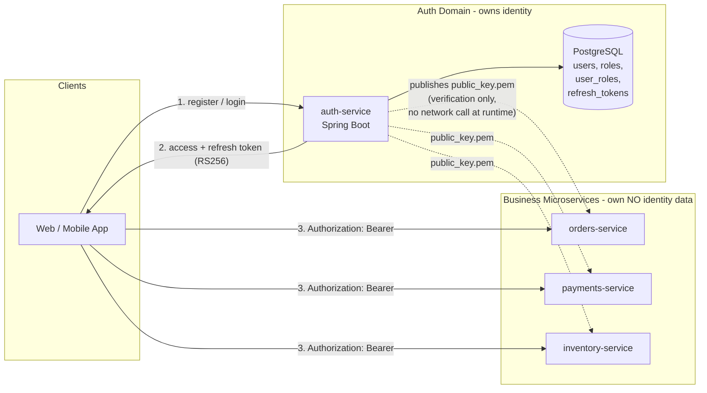
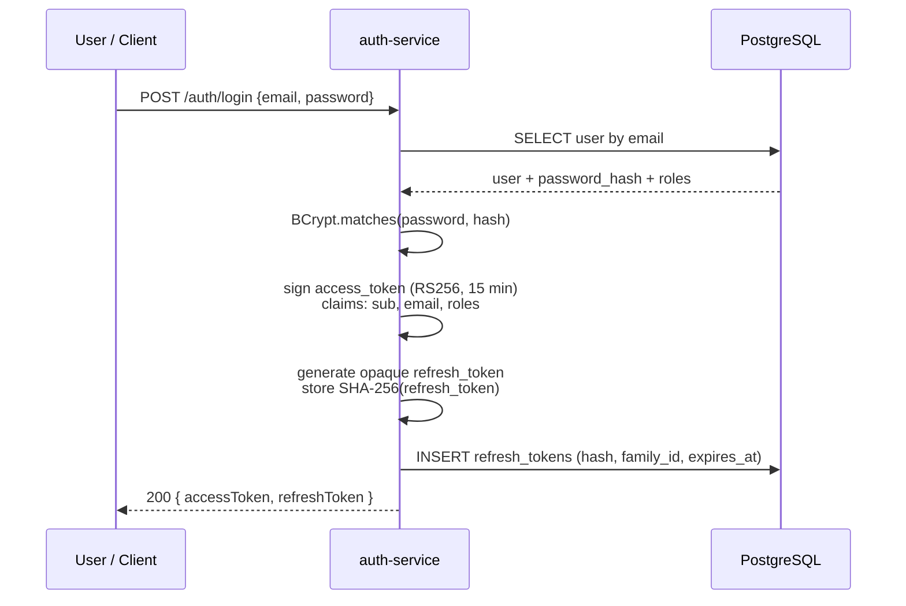
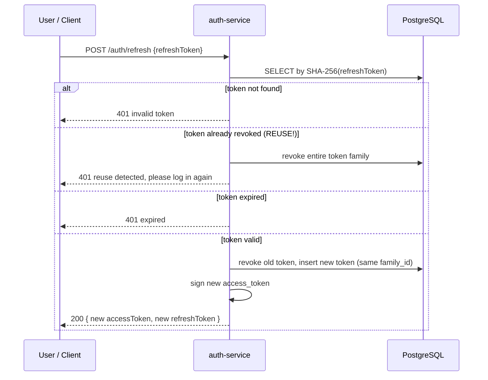
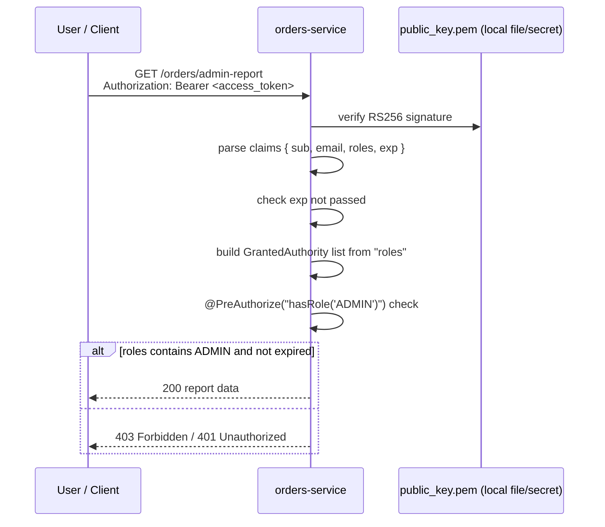

# Architecture & Authentication Flow

## 1. High-level architecture

Key point: after the public key is distributed once (config, secret manager, or a
`/.well-known/jwks.json` endpoint), **downstream services validate tokens locally**.
There is no synchronous call back to `auth-service` on the request hot path — this
keeps the auth-service decoupled and avoids it becoming a single point of failure /
latency bottleneck for every request in the system.

## 2. Login + token issuance

## 3. Refresh token rotation (with reuse detection)

## 4. Downstream service validating a token (no DB call)

## 5. Why this design

- **Single source of truth for identity**: only `auth-service` can create users,
  assign roles, or issue tokens. Every other service is "dumb" with respect to identity.
- **RS256 (asymmetric) over HS256**: the private key never leaves `auth-service`.
  Downstream services get only the public key, so a compromised downstream service
  can *verify* tokens but can never *forge* one.
- **Refresh token rotation + reuse detection**: every refresh both invalidates the
  old refresh token and detects replay of a stolen one, limiting the blast radius
  of a leaked token.
- **Stateless access tokens**: downstream services don't need a DB round trip or a
  network call to auth-service per request — they just verify a signature and read
  claims, which scales horizontally with zero added latency.
